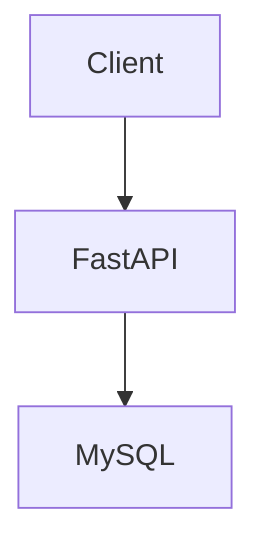
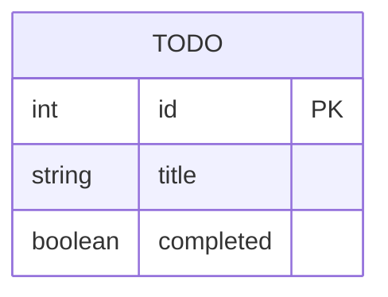

# HLD

## システム概要
ToDoを管理するWeb APIアプリケーション

## 使用技術
- FastAPI
- MySQL
- Docker
- Poetry

## 機能一覧
ToDo一覧表示
ToDo追加
ToDo削除
ToDo更新
完了状態の切り替え

# システム構成

## ディレクトリ構成

app/
├── api/
├── schemas/
├── models/
├── crud/

tests/
docs/

api:
APIルーティングを担当

schemas:
request/response定義

models:
DBモデル定義

crud:
DB操作

## API一覧
- GET /todos
- POST /todos
- PUT /todos/{id}
- DELETE /todos/{id}
- PATCH /todos/{id}/complete

## DB設計

## データフロー
1. Client → FastAPI (Request)
2. FastAPI → Schema Validation
3. Schema → Model Conversion
4. Model → CRUD Operation
5. CRUD → Database
6. Response → Client

## 開発方針

- REST APIで実装する
- routerにDB処理を書かない
- schemaでvalidationを行う
- AIが読みやすい構成を意識する

## セキュリティ設計
- CORS設定
- 入力バリデーション（Pydantic）
- エラーレスポンスの情報漏洩防止
- 将来的な認証（JWT/OAuth）

## AI活用開発プロセス
- コード生成: AIアシスタントによるボイラープレートコード作成
- コードレビュー: AIによるコード品質チェックと改善提案
- テスト生成: AIによるユニットテストと統合テストの自動生成
- ドキュメント生成: AIによるAPIドキュメントと設計書の自動作成
- デバッグ支援: AIによるエラー解析と修正提案

## AI開発ワークフロー
1. 要件定義: AIによる要件整理と仕様生成
2. 設計: AI支援のHLD/LLD作成
3. 実装: AIコード生成とレビュー
4. テスト: AIテスト生成と実行
5. デプロイ: AIによる設定最適化