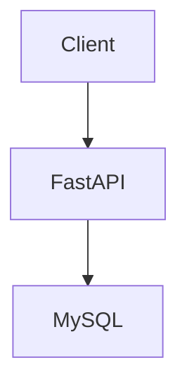
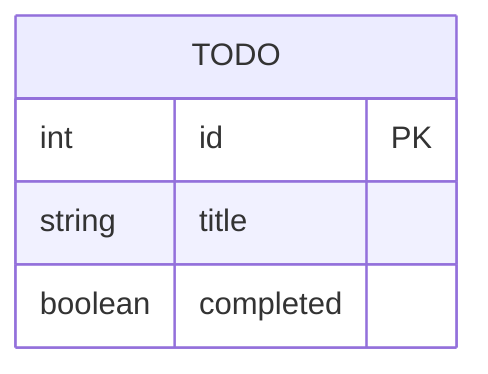

# HLD (High-Level Design)

## 1. システム概要
ToDoを管理するWeb APIアプリケーション

## 2. 使用技術
- FastAPI
- MySQL
- Docker
- Poetry

## 3. システム構成


## 4. ディレクトリ構成
```
app/
├── api/
├── schemas/
├── models/
├── crud/

tests/
docs/
```

### 各ディレクトリの役割
- api: APIルーティングを担当
- schemas: request/response定義
- models: DBモデル定義
- crud: DB操作

## 5. API設計
### エンドポイント一覧
- GET /todos
- POST /todos
- PUT /todos/{id}
- DELETE /todos/{id}
- PATCH /todos/{id}/complete

## 6. DB設計


## 7. 機能一覧
- ToDo一覧表示
- ToDo追加
- ToDo削除
- ToDo更新
- 完了状態の切り替え

## 8. AI活用開発プロセス
- コード生成: AIアシスタントによる実装支援
- コードレビュー: AIによる品質チェック
- テスト生成: 自動テスト作成
- ドキュメント生成: HLD/LLDの自動作成

## 9. セキュリティ設計
- CORS設定
- 入力バリデーション
- エラーレスポンスの安全化

## 10. 運用設計
- Dockerコンテナ化
- 環境別設定管理
- ログ収集
- ヘルスチェック

## 11. 拡張性設計
- マイクロサービス化の可能性
- AI機能追加の余地
- キャッシュ層導入

## 11.テスト
ーpytest使用
ーCRUD API自動テスト
