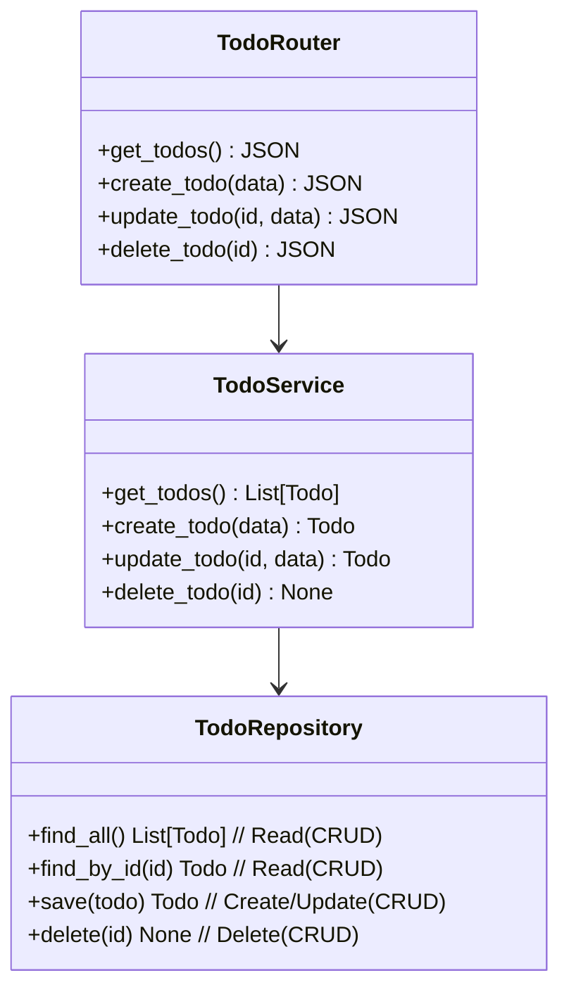
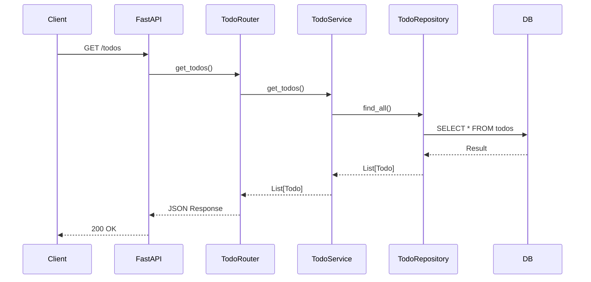

# LLD (Low-Level Design)

## 1. 概要
ToDo APIの詳細設計。HLDに基づき、各コンポーネントの詳細仕様を定義。

## 2. クラス設計


### ディレクトリ構成との対応
- `app/crud/`: TodoRepositoryの実装（CRUD操作）
- `app/models/`: Todoエンティティ定義
- `app/schemas/`: リクエスト/レスポンスDTO
- `app/api/routes/`: TodoRouterの実装（FastAPI APIRouter）

## 3. API詳細仕様

### 3.1 ToDo一覧取得
#### Endpoint
GET /todos

#### シーケンス図


#### Response (200)
```json
[
  {
    "id": 1,
    "title": "買い物",
    "completed": false
  }
]
```

#### エラーレスポンス
- 500 Internal Server Error: DB接続エラー

#### 異常系・戻り先
| ケース | API応答 | messageId | nextAction | 戻り先 |
| --- | --- | --- | --- | --- |
| DB接続エラー | 500 SYSTEM_ERROR | e.common.system.001 | - | クライアント側エラー表示 |

#### 補足
- 空のリストは正常応答とし、warningsは不要。
- 認証不要のAPIなので、セッション管理なし。

### 3.2 ToDo追加
#### Endpoint
POST /todos

#### Request Body
```json
{
  "title": "買い物"
}
```

#### バリデーション
- title: 必須、文字列、1-100文字
- description: オプション、文字列、0-500文字

#### Response (201)
```json
{
  "id": 1,
  "title": "買い物",
  "completed": false
}
```

#### エラーレスポンス
- 400 Bad Request: バリデーションエラー
- 500 Internal Server Error: DB保存エラー

#### 異常系・戻り先
| ケース | API応答 | messageId | nextAction | 戻り先 |
| --- | --- | --- | --- | --- |
| titleが空または100文字超 | 400 VALIDATION_ERROR | e.common.validation.001 | - | クライアント側エラー表示 |
| DB保存エラー | 500 SYSTEM_ERROR | e.common.system.001 | - | クライアント側エラー表示 |

#### 補足
- IDは自動生成し、重複なし。
- completedはデフォルトfalse。

### 3.3 ToDo更新
#### Endpoint
PUT /todos/{id}

#### Request Body
```json
{
  "title": "勉強",
  "completed": true
}
```

#### パスパラメータ
- id: 必須、整数、1以上

#### Response (200)
```json
{
  "id": 1,
  "title": "勉強",
  "completed": true
}
```

#### エラーレスポンス
- 404 Not Found: 指定IDのToDoなし
- 400 Bad Request: バリデーションエラー

#### 異常系・戻り先
| ケース | API応答 | messageId | nextAction | 戻り先 |
| --- | --- | --- | --- | --- |
| 指定IDのToDoが存在しない | 404 NOT_FOUND | e.todo.not_found.001 | - | クライアント側エラー表示 |
| titleが空または100文字超 | 400 VALIDATION_ERROR | e.common.validation.001 | - | クライアント側エラー表示 |

#### 補足
- 部分更新可能（titleまたはcompletedのみ更新）。
- updated_atは自動更新。

### 3.4 ToDo削除
#### Endpoint
DELETE /todos/{id}

#### パスパラメータ
- id: 必須、整数、1以上

#### Response (204)
No Content

#### エラーレスポンス
- 404 Not Found: 指定IDのToDoなし

#### 異常系・戻り先
| ケース | API応答 | messageId | nextAction | 戻り先 |
| --- | --- | --- | --- | --- |
| 指定IDのToDoが存在しない | 404 NOT_FOUND | e.todo.not_found.001 | - | クライアント側エラー表示 |

#### 補足
- 削除成功時は204 No Contentを返す。
- 存在しないIDの削除はエラー扱い。

## 4. データベース設計詳細
### テーブル定義
```sql
CREATE TABLE todos (
    id INT AUTO_INCREMENT PRIMARY KEY,
    title VARCHAR(100) NOT NULL,
    description TEXT,
    completed BOOLEAN DEFAULT FALSE,
    created_at TIMESTAMP DEFAULT CURRENT_TIMESTAMP,
    updated_at TIMESTAMP DEFAULT CURRENT_TIMESTAMP ON UPDATE CURRENT_TIMESTAMP
);
```

### インデックス
- PRIMARY KEY on id
- INDEX on completed (完了状態検索用)

## 5. エラーハンドリング設計
- HTTPExceptionを使用した統一エラーレスポンス
- ログ出力: エラー発生時に詳細を記録
- バリデーションエラー: PydanticのValidationErrorをハンドリング

## 6. セキュリティ詳細
- 入力サニタイズ: SQLインジェクション防止
- レートリミット: 将来的に導入検討
- CORS: フロントエンド連携用設定

## 7. AI活用開発ポイント
- シーケンス図生成: AIツールによる自動作成
- コードレビュー: AIによる詳細設計の検証
- テストケース生成: AIによる境界値テストの提案

## 8. 実装・テスト着手ポイント
- TodoRepository: CRUD操作の単体テストを優先（DB接続不要）。
- TodoService: ビジネスロジックの統合テスト。
- TodoRouter: APIエンドポイントの結合テスト（httpx使用）。
- エラーハンドリング: 異常系のテストケースを網羅。
- バリデーション: Pydanticスキーマの境界値テスト。